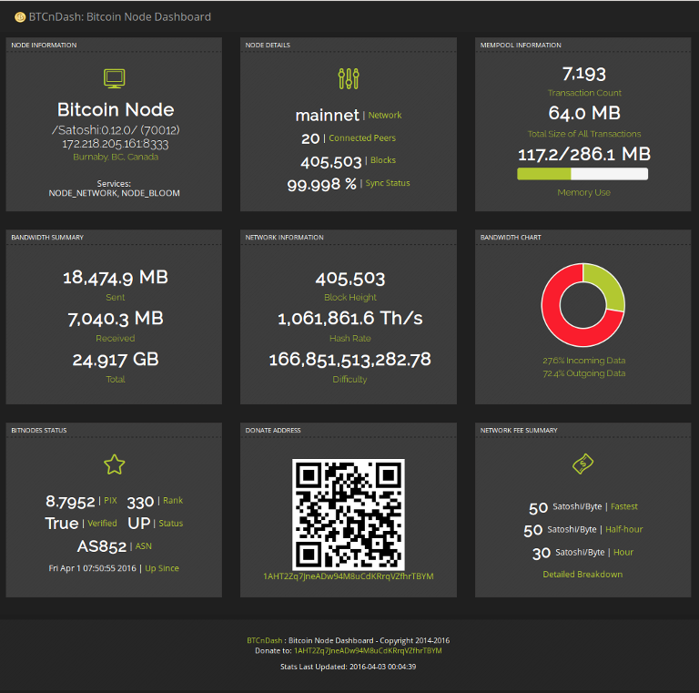

========
BTCnDash
========

BTCnDash: Script to display status dashboard of a full Bitcoin node

.. contents:: Table of contents

RPC and Bitcoin Node Settings
=============================

RPC_UNAME
    RPC username. Used to log into the bitcoind RPC server, which must be endabled.
RPC_PWORD
    RPC password.Used to log into the bitcoind RPC server.
RPC_IP
    IP address of server to which RPC calls will be made (the computer on which bitcoind is running). This is typically the same machine this script is running on, but doesn't have to be. If it is not the same machine, be sure that your firewall allows the RPC_PORT through.
RPC_PORT
    The port to use when making RPC requests to bitcoind
NODE_PORT
    The port on which the bitcoind daemon is listening for bitcoin protocol requests. This is used for informational purposes only.

General settings
================

DONATE_ADDRESS
    Bitocoin address to which donations can be sent for this bitcoin node server. This will be displayed on the dashboard and used to automatically generate a qr code.
CACHE_TIME
    How often, in seconds, the status pages will be refreshed. The pages are refreshed by a background task.
CACHE_TIME_LOC
    How often, in seconds, the IP address and location will be refreshed. This is done by a background task. It is separe from the other page cache becaues it should rarely change so should have a much longer refresh time.

Local Server Settings
=====================

SERVER_IP_LOCAL
    The local, internal IP address of the server running BTCnDash. Used by the Bottle framework to decide which IP to listen on.
SERVER_IP_PUBLIC
    The public, external IP address of the server running BTCnDash. Used to find the location of the server and for informational purposes. This will be auto-detected
SERVER_PORT
    The port on which BTCnDash will listen for requests. Can't be the standard port 80 unless you run BTCnDash as root, which is not recommended.
SERVER_TYPE
    The type of server that the Bottle framework will use to serve pages. More information on the choices is available on the bottle home page: http://bottlepy.org/docs/dev/deployment.html#switching-the-server-backend
SERVER_LOCATION
    Physical location of the BTCnDash server. This will be auto-detected.
DEBUG
    Sets whether or not the Bottle framework server will run in debug mode. Disable this on production servers!
APP_ROOT
    Should be autodetected, but must be the absolute path to the main python file (btcndash.py).
PAGES
    Stores the location of the static files to be serves as well as the name of the template to use when creating them.

External API settings
=====================

QR_URL
    Address to use for generating qr codes
QR_PARAM
    Parameters to pass to the qr code generating service
BLOCK_HEIGHT_URL
    Address to use when displaying information about the current block height
IP_INFO_URL
    Address to use when displaying information about a Bitcoin node
TX_INFO_URL
    Address to use when displaying information about a Bitcoin transaction
HASH_DIFF_URL
    Address to use when displaying information about the Bitcoin network hash rate and difficulty
LOC_URL
    Service to use to get current IP address and location
MAP_URL
    Address to use to create link to map of current location
